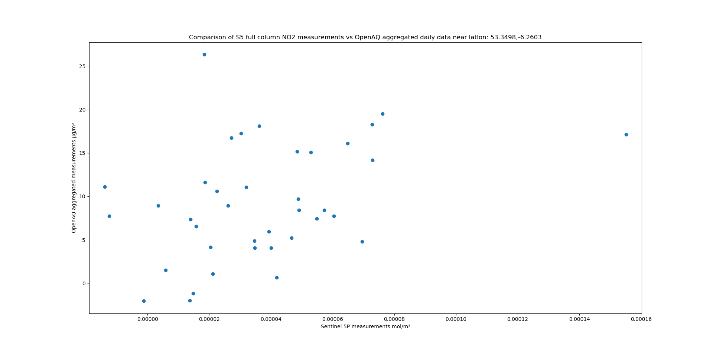

A PoC for taking data from [openaq](www.openaq.org)'s API and mapping it onto Sentinel 5P L2 full column daily averaged values. 

The available atmospheric gases which can be retrieved are CO, NO2, SO2 and O3.

The lambda proxies openaq's API, then subsequently calls the [meeo STAC catalog](https://github.com/Sentinel-5P/data-on-s3/blob/master/DocsForAws/Sentinel5P_Description.md) to retrieve values for a parameter for the given coordinates, for each date where a measurement exists on the openaq API.

This repository consists of two lambda functions - openaq_s5.py and retrieve_s5.py

openaq_s5.py can be initialized as normal per [AWS' guide](https://docs.aws.amazon.com/lambda/latest/dg/python-package.html)

retrieve_s5.py requires geographic libraries - I used [geolambda](https://github.com/developmentseed/geolambda) to initialize it.

The openaq_s5 lambda will call retrieve_s5 once for every date in the openaq data.

I've included a script which will produce a scatter chart as below - it requires matplotlib

To-do:

1. We can retrieve the timestamps for the Sentinel-5 measurements with a bit of wrangling, would be better than a daily average
2. Filtering openaq data